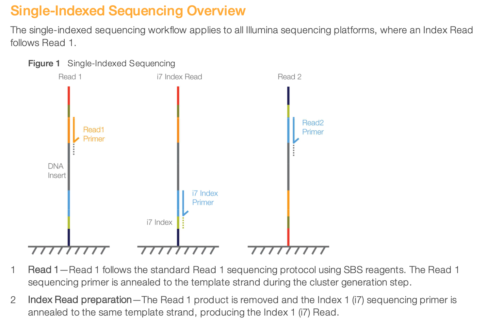
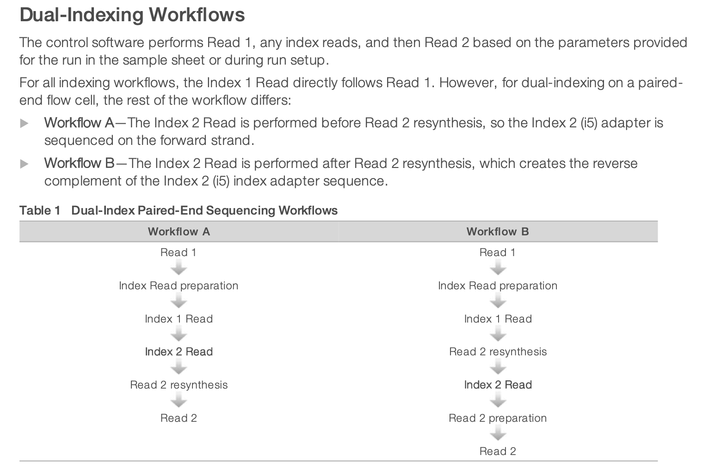
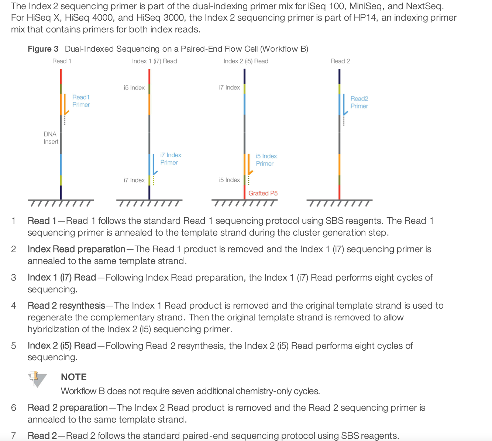

## Sample sheet and demultiplexing

### How do I prepare my sample sheet?
At the end of the sequencing run, the raw data consist of images in the form of bcl files. The first data processing step is to generate fastq files.
In most sequencing runs, several samples are combined with a set of multiplexing barcodes. It is called indexed sequencing and you can read more in the section below. Thus the demultiplexing step will generate a fastq file for each sample using the information from the sample sheet (which associate barcodes - singe or dual - to sample names).

1. Download the template depending on your experiment: either ["https://alumni.sharepoint.com/:x:/r/sites/UCPH_SUND_GENOMICS_PLATFORM/Shared%20Documents/shared_samplesheet_templates/samples-bulk.xlsx?d=w0823af00c82742d3ae6de6fe3d9f8335&csf=1&web=1&e=LHfyZm"](10X template) or ["https://alumni.sharepoint.com/:x:/r/sites/UCPH_SUND_GENOMICS_PLATFORM/Shared%20Documents/shared_samplesheet_templates/samples-bulk.xlsx?d=w0823af00c82742d3ae6de6fe3d9f8335&csf=1&web=1&e=LHfyZm"](bulk template) 
2. Fill out the template for this experiment, following the instructions below
3. Place the excel file in the submission folder of your specific run

#### Filling out the bulk template
* name
  * this column will define how the fastq files are named (an ending will be added with S1.fastq.gz, S2.fastq.gz, ...)
  * each name should be a one word (no space) without any special character (no #, +, -, % or other funny things - just letters, numbers, - and _ to separate). Please do not start with a number but rather with a letter (as this can be annoying afterwards in R)	
* i7
  * this is the sequence of the i7 barcode used for demultiplexing (we used to call it seqIndex1 - but try to remove confusion here)
  * it is typically 6 or 8 bp, depending on the multiplexing kit (e.g. NEB, etc.) - but it could be a different number depending on your kit
* i5
  * this is the sequence of the i5 barcode (we used to call it seqIndex2 - but try to remove confusion here)
  * if you use single-indexing, leave that column empty
  * (note: for the CRISPR screens, this is the reverse-transcription of what you typically write in your i5 column - but we extract the indices from the full sequence anyway)	
* species
  * to double-check the info we have and in case not all samples are the same, so we can split for processing
* contact
  * when this is your project and you have prepared all samples and libraries, you just put your firstname
  * when the pool is a merge of several libraries prepared by different people, or your prepared libraries from sets of samples coming from different people, you write the firstname of those people so we know which is which
* split
  * if the run contains different sets of samples that need a different pipeline (e.g. different species and/or different library types), please write here a one word that we will use to split the files before running the pipeline
  * e.g. CHOR_mm CHOR_hg SCAR_mm

#### Filling out the 10X template
  * If you have run 10X without hashes, just fill out the GEX table
  * If you have run 10X with hasning, fill out both tables GEX and Hashing
  * Just fill out values with the number of lines that you need
  * Do not edit the headers
  * Do not add additionnal information (you can email us instead if you want to provide some more info)
  * Do not use any special character in the naming, nor space (in short, you can use letters and digits, possibly - and _)

### What demultiplexing strategy do I need?

#### Standard demultiplexing
  * We will use bcl2fastq with standard options
  * bcl2fastq -R $RAWRUN -o . -r 16 -p 16 --sample-sheet samplesheet.csv --no-lane-splitting

#### Custom demultiplexing
  * We will add a regular expression to specify the structure of the reads and indices and what we want to extract (e.g. parts of index and read), typically
  * bcl2fastq -R $RAWRUN -o . -r 16 -p 16 --sample-sheet samplesheet.csv --no-lane-splitting --use-bases-mask REGULAR_EXPRESSION --create-fastq-for-index-reads --mask-short-adapter-reads=8
  * In this case, you do need to specify in the request form the regular expression you want us to use with the --use-bases-mask option
    * E.g. TTchem single-read single-indexed: Y*,I8Y11
    * E.g. TTchem single-read dual-indexed: Y*,I8Y11,I8

### How does indexed sequencing work

To get all the details of indexed sequencing, you can read more from the [https://dnatech.genomecenter.ucdavis.edu/wp-content/uploads/2019/02/indexed-sequencing-overview-guide-15057455-04-Illumina-pages1to8.pdf](Illumina documentation here). Let's just show here the illustration of single and dual-indexed sequencing.

This is an illustration of single-indexed library sequencing.

For dual-indexed library sequencing, please note that Illumona has 2 different workflows for different instruments. It means that in the indexing kit, you need to choose the column appropriate for NextSeq sequencing. It is using the Workflow B illustrated below.

 
Go back to the [Genomics Platform home](https://sundgenomics.github.io)
