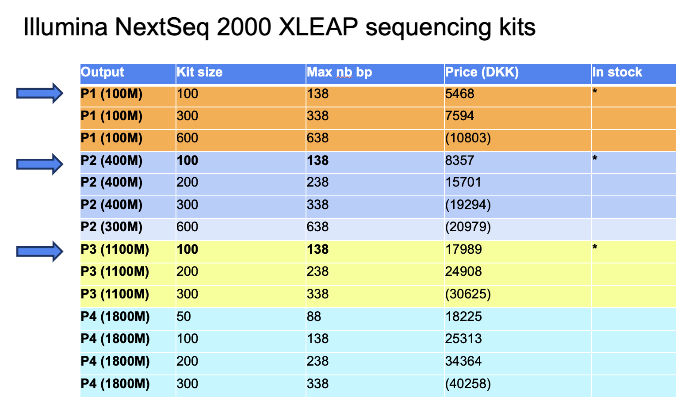

## Direct Sequencing Service

### What is it?
This is a sequencing service we provide for scientists who have experience with sequencing and are doing regular sequencing with the platform without needing much support from us.

* We suggest that the request is send at least 4 days in advance of the pool being ready (ideally a week) so we can plan accordingly (kit, sequencing time slot, check files) and address your request asap when the pool is in the freezer
* Each submission is independant and typically corresponds to one sequencing run
* In some cases, if you don't need the full output of a run, we can pool 2 submissions together (we talk about that on email)
* If delay in lib prep, a sequencing request can be postponed to the following week, but not more. In that case it is cancelled and resubmitted when the libraries are close to ready.

### How does it work?

1. You create your submission folder
     * Connect to the submission folder 
       * `smb://unicph.domain/groupdir/SUN-RENEW-genomics-users/DIRECT-SEQUENCING-SUBMISSION/`
       * If you don't have access but have already done the  [onboarding](onboarding.md), please contact the platform by email at genomics@sund.ku.dk
     * Create a folder
       * Typically Application-Name (e.g. SCAR-Valentin) 
       * With an index if submitting several runs in a short period of time (e.g. SCAR-Valentin-1, SCAR-Valentin-2)
     * Prepare the samplesheet
       * Following the instructions [here](demux.md)
       * Place it in the folder just created (If not available yet, place it as soon as available - and BEFORE sequencing)
     * Place the Tape Station or Fragment Analyser report in the folder
        * If not available yet, place it as soon as you have it
2. You fill the sequencing request form [here](https://smart-forms.saasjet.com/e/COZtF5vWtp_)
     * When we ask for the folder name, it is the name of the folder you just created
     * For any additional information, there is a free text field at the end
     * By default, we add PhiX. If you don't want that, please indicate in the final text box.
     * Regarding the data analysis, if you want the fastq files to process yourself, you select FASTQ, otherwise you can choose one of the existing pipelines (described here soon..). If you need more, then we need a meeting beforehand.
     * After you submit, you will receive your submission by email (on the email you have filled at the top)
     * You can now add your submission ID at the start of the folder name
3. We validate the submission
     * When we receive the request, we look at it and check if everything is clear (or ask questions if not)
     * We schedule the sequencing with the first availability from the date you have mentioned that the samples are ready
     * We check that we have the required files at least the day before the schedule sequencing date
4. You place the submission pool in the freezer
     * Label the tube with submission ID, library concentration, name or initials and date of library submission to our freezer.
     * min. 45 uL at 1nM
     * min. 20ul at 4nM (fully QCed library pools only)
     * min. 10ul at 10nM (pooled libraries for platform QC)

During that process, if there is any question or change, please email us at genomics@sund.ku.dk mentioning the submission_ID.

If you have any suggestions to improve this process, please let us know.

### How many base pairs / cycles

 * The number of cycles availble for sequencing is determined by the kit and it reagent size. For Illumina NextSeq 2000, the sequencing kits and sizes are listed [here](https://www.illumina.com/products/by-type/sequencing-kits/cluster-gen-sequencing-reagents/nextseq-1000-2000-reagents.html) (with their price).
 * The kits in fact have more reagents than what is advertised on the product page and can run more cycles than the kit size. You can find the max number of cycles possible for each kit listed [here](https://support.illumina.com/bulletins/2016/10/how-many-cycles-of-sbs-chemistry-are-in-my-kit.html).
 * The max number of cycles can be distributed as you want between read 1, read 2, index 1, index 2
 * For example
   * a P2 v3 kit with 100 cycles (max=138) could be used 
     * 130 bp on read 1, 8 bp on index 1
     * 61 on read 1, 61 on read 2, 8 bp on index 1, 8 bp on index 2
     * 28 on read 1, 90 on read 2, 10 bp on index 1, 10 bp on index 2
   * a P3 kit with 50 cycles (max=88) could be used 
     * 80 bp on read 1, 8 bp on index 1
     * 41 on read 1, 41 on read 2, 6 bp on index 1
 * Find a summary table here:

 
Go back to the [Genomics Platform home](https://sundgenomics.github.io)
