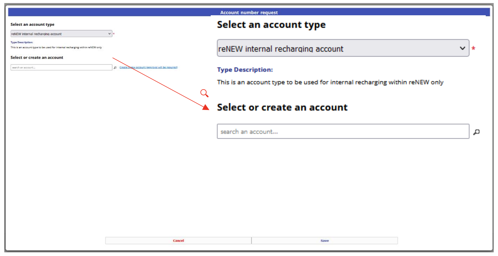

## PPMS booking system

### What is it?
PPMS is the online booking and ordering system we use in all platforms at reNEW. If you want to use the [Genomics Platform](https://sundgenomics.github.io), you will need to first contact us for an [onboarding meeting](/onboarding/). When the meeting is scheduled, you can prepare by creating your PPMS account (if you don't already have one). All users must have a PPMS account. Even if you might not use it yourself for booking or ordering, we will use it for recharging the price of the sequnecing kit we use for your project.

### Creating your account

1. Login with you KUID [here](https://ppms.eu/ku/start/)
2. Klick through to request an account
3. Fill out your name, phone and select a group, then click on "Financial Account number:" bubble

4. A new window pops up, select "reNEW internal recharging account"

5. Search for your Group and select the correct one, or just search for the account number and select it and then click Save at the bottom of the window

 
Go back to the [Genomics Platform home](https://sundgenomics.github.io)
