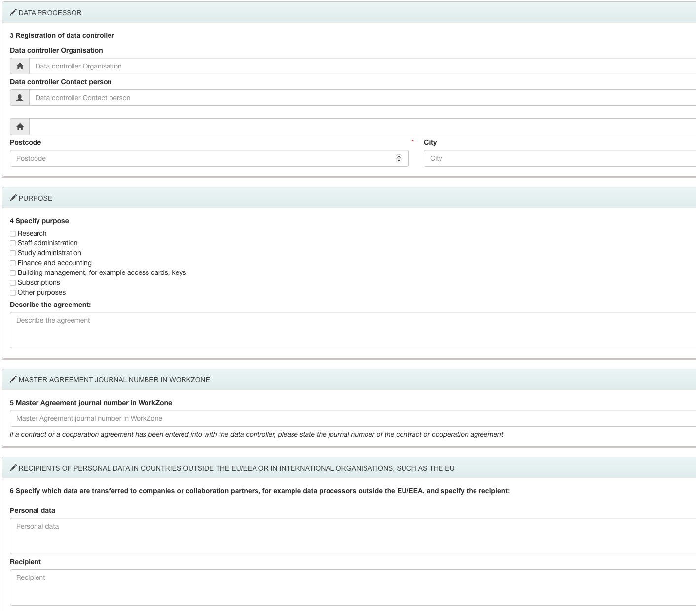
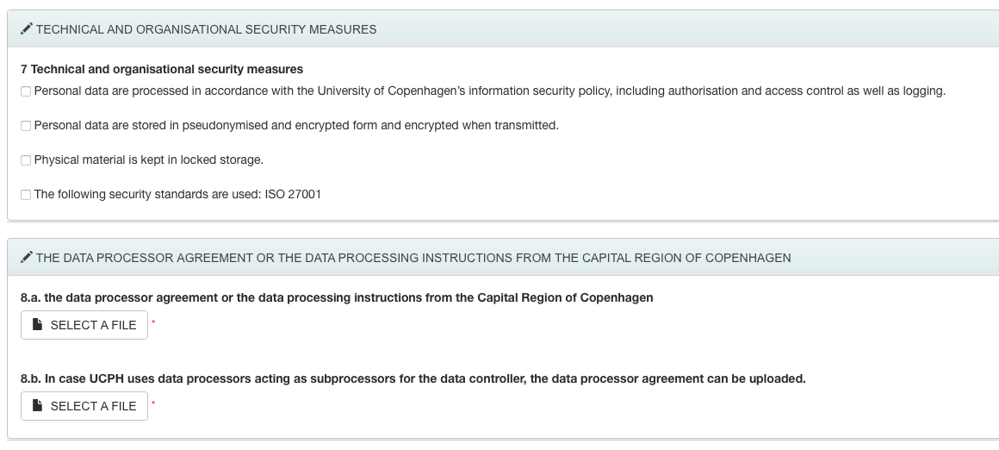

## Sequencing Sensitive Data

### Patient sequences can contain sensitive data

NGS sequences derived from living persons have a potential to contain sensitive personal data subjected to GDPR and Danish National Data protection law, therefore you should think if your sequencing project will need safe handling/storage procedures suited for handling sensitive personal data. You need to obtain a permission from your local Data Protection Agency and consent from the study subjects to store the data on special repositories. You can use [EMBL-EBI submission wizard](https://www.ebi.ac.uk/submission/) to understand where your data should be uploaded.

Not all sequencing technologies produce sensitive data - please consider if you can select a sequencing method that restricts the possibility of re-identification of individuals from a raw sequencing file.

Sequencing assays that produce sensitive data: 

- whole genome sequencing  
- full length RNA sequencing (for example, standard bulk RNA-seq)  
- microbiome sequencing (contains human DNA contamination)  

Sequencing assays that produce non-sensitive data:

- for RNA expression analysis: 3’ or 5’ DGE. This is a cost-effective alternative to full-length transcriptome sequencing for either sc-RNA applications or bulk RNA. The output of these sequencing assays does not contain enough of SNPs to re-identify Individuals and can be treated as regular data.  

### Data Processing Agreements and Roles
Processing of sensitive data requires a data processing agreement defining the roles of data controller and data processor(s) as well as how data will be handled between those roles. Genérally speaking, if you come to use with a data containing sensitive data (e.g. sequencing libraries from patient samples), you are the data controller and the Genomics Platform is the (or one of the) data processor.

You can read about KU rules for data processing [here on KUnet](https://kunet.ku.dk/work-areas/research/data/personal-data/dataprocessors/Pages/default.aspx). In short:
   * Personal data must not be processed until a data processing agreement has been signed.
   * Data processing agreements must be registrered in [Workzone - group 515](https://kuforms.ku.dk/xform/frontend/FormEngine/v2/ShowForm.aspx?alias=FA3027&groupId=2&casefolderid=1&doctype=5&formid=4102).
   * University of Copenhagen may perform tasks as data processor for another research institution which is conducting a research project.

### Collaborating outside KU

If [a general data processing agreement exists between KU and the collaboration partner](https://kunet.ku.dk/work-areas/research/data/personal-data/statistics-denmark/Pages/default.aspx), you do not need to make a separate data procesing agreement. Among others, KU has general data processing agreements with [Region Hovestaden](https://www.regionh.dk/english/about-the-capital-region/facts-about-the-region/Pages/Organisational-chart-for-the-Capital-Region-of-Denmark.aspx), which includes several hospitals. Some info here:
>**Data Processing agreement with the Capital Region of Denmark (region H)**  
>The agreement lays down rules for the processing of personal data when the Capital Region of Denmark performs data processing assignments for the University of Copenhagen in connection with research projects. The agreement also lays down rules for the processing of personal data when the University of Denmark performs data processing assignments for the Capital Region of Denmark in connection with research projects.
The agreement covers both data and biological material. 

>**When UCPH processes personal data for the Capital Region**  
>When the University of Copenhagen processes personal data for the Capital Region of Copenhagen, the University of Copenhagen will receive instructions from the Capital Region of Denmark. The instructions must be uploaded in a [UCPH formular](https://kuforms.ku.dk/xform/frontend/FormEngine/v2/ShowForm.aspx?alias=FA3027&groupId=2&casefolderid=1&doctype=5&formid=4102), so that they can be archived in the University of Copenhagen's archiving system. 
    
### What do we need from you

**For data controllers at KU**
   * Link to the data processing agreement registration in  [Workzone - group 515](https://kuforms.ku.dk/xform/frontend/FormEngine/v2/ShowForm.aspx?alias=FA3027&groupId=2&casefolderid=1&doctype=5&formid=4102)
   * Confirmation that our practical workflow is in agreement with you data processing agreement

**For data controllers at Capital Region of Denmark (Region H)**

If your collaboration is covered by the general data processing agreement, the genomics Platform will fill [UCPH formular](https://kuforms.ku.dk/xform/frontend/FormEngine/v2/ShowForm.aspx?alias=FA3027&groupId=2&casefolderid=1&doctype=5&formid=4102) to register as Data Processor on your project. To be able to fill beyond the part that is related to the Platform (Registrant and Data processor), the Genomics Platform needs to know from you (see printscreens below):
   * Registration of data controller: Organization, Person, Address
   * Specify purpose: Which box(es) to tick + text description
   * Master Agreement journal number in WorkZone (if any)
   * Specify which data are transferred to companies or collaboration partners (if any)
   * The data processor agreement or the data processing instructions from the Capital Region of Copenhagen

### Our practical workflow
For sensitive data projects, we will generate raw sequencing data on the sequencer only and sync the data also only on the sequencer while it's running (for other runs, we sync the data onto a N-drive while sequencing, but this is not allowed for sensitive data). After that, we need you to indicate on which location we can transfer the data, e.g.:
   * Your project-specific S-drive, to which we need access
   * You project on [SIF](https://sif.ku.dk) (e.g. ERDA solution for sensitive data), to which we need access

Go back to the [Genomics Platform home](https://sundgenomics.github.io)
